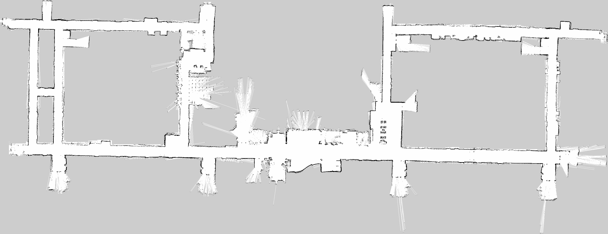

Long-term indoor dataset
------------------------

This dataset contains laser scans, odometry, and AMCL results of a SCITOS-G5 robot which was roaming an indoor environment for more than 100 days. The robot served as an info-terminal, assistant-therapist and bellboy in a care home in Vienna for from November 2016 to April 2017, covering autonomously over 100km.

\
 \
 \

  ---------------------------------
  
  Map of the AAF environment
  ---------------------------------

\
 \

* * * * *

### Dataset structure and download

The data, which are organised in archive files of one-day length are available [here](https://lcas.lincoln.ac.uk/owncloud/shared/datasets/AAF_Y4/). Moreover, the events, when the robot got mislocalised, are [here](https://lcas.lincoln.ac.uk/owncloud/shared/datasets/AAF_Y4/y4_glitches/). The overall report on the robot navigation activity at the AAF is available in as a google doc [spreadsheet](https://docs.google.com/spreadsheets/d/1SeyMyPDr4WoCeIf0-GxYsnGRLkYnFpTZcfQGw0nYSns/edit?usp=sharing)

* * * * *

### Condition of use

If you use the dataset for your research, please cite our [paper](https://lcas.lincoln.ac.uk/owncloud/shared/datasets/AAF_Y4/paper.pdf), for which we originally collected the data. We attached a [bibtex](https://lcas.lincoln.ac.uk/owncloud/shared/datasets/AAF_Y4/paper.bib) record for your convenience.

* * * * *

This dataset is part of the larger [LCAS-STRANDS long-term dataset collection](https://lcas.lincoln.ac.uk/owncloud/shared/datasets/index.html).
