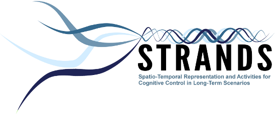

STRANDS Data Sets
=================

**STRANDS** data sets are provided for testing and benchmarking robotics and computer visions algorithms.

[TUW data sets](https://repo.acin.tuwien.ac.at/tmp/permanent/dataset_index.php): Several RGB-D Ground truth and annotated data sets from TUW. This data is targeted towards object instance recognition. Data was collected as in: Aitor Aldoma, Thomas Fäulhammer, Markus Vincze, "Automation of Ground-Truth Annotation for Multi-View RGB-D Object Instance Recognition Datasets", in IEEE/RSJ International Conference on Intelligent Robots and Systems (IROS), 2014.

[3DNet Dataset](https://repo.acin.tuwien.ac.at/tmp/permanent/3d-net.org): The 3DNet dataset is a free resource for object class recognition and 6DOF pose estimation from point cloud data. 3DNet provides a large-scale hierarchical CAD-model databases with increasing numbers of classes and difficulty with 10, 60 and 200 object classes together with evaluation datasets that contain thousands of scenes captured with an RGB-D sensor. Alternative link: [3DNet Dataset](https://strands.pdc.kth.se/public/3DNet_Dataset/)

[LAD](https://dartportal.leeds.ac.uk/dataset/lad): The Leeds Activity Dataset--Breakfast (LAD--Breakfast) is currently composed of 15 annotated videos, representing five different people having breakfast or other simple meal; it is recorded within a lab setting, but is as realistic as possible (real food, eating and drinking). The videos were recorded using an ASUS Xtion PRO LIVE - RGB and Depth Sensor. The objects in the video were tracked using an OpenNI based tool created by our RACE project partner, the University of Aveiro (this data set has be co-created by RACE and STRANDS) and the ground truth provided makes reference to the objects tracked. The videos have been annotated with activities at various levels of complexity and abstraction to be selected, in order to build a hierarchy of activities. The videos were not scripted in detail: each person could choose what to eat or drink and when, and the objects he needed were on the table. The videos are quite varied in terms of duration, type and sequence of activities, number and type of visible objects. High level activities such as "preparing coffee" or "consuming meal" are composed of low level ones (e.g. "pickup kettle", "pour kettle", "putdown kettle"). (e.chinellato@leeds.ac.uk) Alternative link: [LAD Dataset](https://strands.pdc.kth.se/public/LAD/)

[MHT RGB-D](https://lcas.lincoln.ac.uk/owncloud/shared/datasets/mht_rgbd.html): RGB-D image data of three locations in a MHT lab collect by a robot every 5 min over 16 days by the University of Lincoln. This data is described in Krajnik et al., Spectral analysis for long-term robotic mapping, ICRA 2014. (tkrajnik@lincoln.ac.uk)

[Witham Wharf](https://lcas.lincoln.ac.uk/owncloud/shared/datasets/wharf_rgbd.html): For RGB-D of eight locations collect by robot every 10 min over \~10 days by the University of Lincoln. Data was described in: Krajnik et al., Long-Term Topological Localization for Service Robots in in Dynamic Environments using spectral maps, IROS 2014. (tkrajnik@lincoln.ac.uk) Alternative link: [Witham Wharf Dataset](https://strands.pdc.kth.se/public/Witham_Wharf_RGB-D_dataset/)

[Small office data sets](https://lcas.lincoln.ac.uk/owncloud/shared/datasets/greg-office.html): Kinect depth images every 5 seconds beginning in April 2014 and on-going. Data is provide by the University of Lincoln. This data is described in Krajnik et al., FROctomap: an efficient spatio-temporal environment representation, Advances in Autonomous Robotics Systems, 2014. (tkrajnik@lincoln.ac.uk)

[Meta rooms](https://strands.pdc.kth.se/public/metric_sweeps_201312/readme.html): RGB-D data comprised of 28 aligned depth camera images collected by having robot go to specific place and do 360 degrees of pan with various tilts. The registered point cloud and individual scans are included, PCD + XML. 3 Rooms, once per day over 7 days. "Meta-rooms: Building and Maintaining Long Term Spatial Models in a Dynamic World", R Ambrus, N Bore, J Folkesson, P Jensfelt, International Conference on Intelligent Robot, IROS2014. (raambrus@kth.se)

[G4S meta rooms](https://lcas.lincoln.ac.uk/owncloud/public.php?service=files&t=cee1ceb7fb49ad373288f1249b7ff48b&dir=%2FG4S_2014): RGB-D data 150 sweeps with 18 images per sweep. This data is not public. (c.j.c.burbridge@cs.bham.ac.uk)

[KTH-3D-TOTAL](https://strands.pdc.kth.se/public/kth-3d-total/readme.html): RGB-D Data with objects on desktops annotated. 20 Desks, 3 times per day, over 19 days. Data provided by KTH and described in, Thippur et al., "KTH-3D-TOTAL: A 3D Dataset for Discovering Spatial Structures for Long-Term Autonomous Learning", International Conference on Control, Automation, Robotics and Vision, ICARCV 2014. (akshaya@kth.se)

[Marathon](https://strands.pdc.kth.se/public/Marathon_2014/readme.html): Strands Marathon 2014 data, from all universities; contains metric sweeps and mongodb databases with other system logs: (raambrus@kth.se)

[Longterm](https://strands.pdc.kth.se/public/KTH_longterm_dataset_registered/readme.html): about 720 sweeps, at \~ 8 different waypoints, over little more than a month; contains 51 intermediate clouds, with camera poses and camera parameters as well as registered and corrected poses and parameters. For more information see "Unsupervised learning of spatial-temporal models of objects in a long-term autonomy scenario", R Ambrus, J Ekekrantz, J Folkesson, P Jensfelt, IEEE/RSJ International Conference on Intelligent Robots and Systems (IROS), 2015. (raambrus@kth.se)

[Longterm Labeled](https://strands.pdc.kth.se/public/KTH_longterm_dataset_labels/readme.html): This dataset contains a subset of the observations from the longterm dataset (longterm dataset above). In addition to the raw data, this dataset also stores for each observation object annotations (masks and labels). For more information see "Unsupervised learning of spatial-temporal models of objects in a long-term autonomy scenario", R Ambrus, J Ekekrantz, J Folkesson, P Jensfelt, IEEE/RSJ International Conference on Intelligent Robots and Systems (IROS), 2015. (raambrus@kth.se)

[Moving Labeled](https://strands.pdc.kth.se/public/KTH_labelled_moving_objects/readme.html): This dataset extends the longterm datatset with more locations within the same office environment at KTH. The dataset contains a subset of the labels and these objects are consistently located in different positions in multiple rooms. (nbore@kth.se)

[People tracks](https://strands.pdc.kth.se/public/TrackData/readme.html): The data was collected at the end of 2014 in University of Birmingham library. It is composed of 6251 human tracks which can be used for human motion analysis. The data is supplied as a mat file. Contact: ferdian.jovan@gmail.com

\

**Contact** \
 John Folksson\
 School of Computer Science and Cmmunications\
 KTH Royal Institute of Technolgy\
 SE-10044 Stockholm \
 Sweden\
 [johnf@kth.se](mailto:johnf@kth.se)\
 [http://www.csc.kth.se/\~johnf/](http://www.csc.kth.se/~johnf/)

* * * * *

 

This project is funded by the European Community's Seventh Framework Programme, Cognitive Systems and Robotics, project reference 600623.

This Website is maintained by the [Automation and Control Institute (ACIN)](http://www.acin.tuwien.ac.at/index.php?id=1&L=1), [TU Vienna](http://www.tuwien.ac.at/tuwien_home/EN/)

[Impressum](http://strands.acin.tuwien.ac.at//impressum.html)
