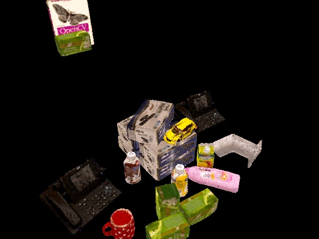

[HOME](https://repo.acin.tuwien.ac.at/tmp/permanent/dataset_index.php)

TUW Object Instance Recognition Dataset
=======================================

This website provides annotated RGB-D point clouds of indoor environments. The TUW dataset contains sequences of point clouds in 15 static and 3 partly dynamic environments. Each view of a scene presents multiple objects; some object instances occur multiple times and are highly occluded in certain views. The model database consists of 17 models with a maximum extent of 30 cm, which are partly symmetric and/or lack distinctive surface texture. The dataset consists of the reconstructed 3D object models, the individual key frames of the models, test scenes and the 6DOF pose of each object present in the respective view. Each point cloud is represented by RGB color, depth and normal information.

Furthermore, we provide annotation for the Willow and Challenge dataset .

 

TUW
---

This dataset is composed of 15 multi-view sequences of static indoor scenes totalling 163 RGB-D frames ( and 3 dynamic scenes with 61 views in total). The number of objects in the different sequences amounts to 162, resulting in 1911 object instances (some of them totally occluded in some frames).

Download:

-   [training set (object models)](https://repo.acin.tuwien.ac.at/tmp/permanent/data/TUW_models.tar.gz) (2.0GB)
-   [test set (multi-view sequences of static [1] and dynamic [2] scenes)](https://repo.acin.tuwien.ac.at/tmp/permanent/data/TUW_test_set.tar.gz) (0.43GB)
-   [ground-truth annotations](https://repo.acin.tuwien.ac.at/tmp/permanent/data/TUW_annotations.tar.gz)

Ground-truth annotation (created by [1] with manual verification)

-   [TUW static [1] + dynamic[2]](show_dataset.php?dir_gt=iros2014/annotated_images/gt&dir_scenes=iros2014/annotated_images/scenes&model_dir=iros2014/training_data/models&dataset=0&frame=0&occlusion_dir=iros2014/semi_automatic_ground_truth&num_shown_dataset_letters=9)

Results:

-   [Obtained by [1]](https://repo.acin.tuwien.ac.at/tmp/permanent/show_dataset.php?dir_gt=iros2014/automatic_images/gt&dir_scenes=iros2014/automatic_images/scenes&model_dir=iros2014/training_data/models&dataset=0&frame=0&occlusion_dir=iros2014/automatic_ground_truth&num_shown_dataset_letters=9)
-   [Obtained by [2]](https://repo.acin.tuwien.ac.at/tmp/permanent/show_dataset.php?dir_gt=iros2014/annotated_images_icra/gt&dir_scenes=iros2014/automatic_images/scenes&model_dir=iros2014/training_data/models&dataset=0&frame=0&occlusion_dir=iros2014/automatic_ground_truth&num_shown_dataset_letters=9)
-   [Obtained by [3]](https://repo.acin.tuwien.ac.at/tmp/permanent/show_dataset.php?dir_gt=iros2014/annotated_images_cvww/gt&dir_scenes=iros2014/automatic_images/scenes&model_dir=iros2014/training_data/models&dataset=0&frame=0&occlusion_dir=iros2014/automatic_ground_truth&num_shown_dataset_letters=9)

 

Willow and Challenge Dataset
----------------------------

The Willow dataset is composed of 24 multi-view sequences totalling 353 RGB-D frames. The number of objects in the different sequences amounts to 110, resulting in 1628 object instances (some of them totally occluded in some frames). The Challenge dataset is composed of 39 multi-view sequences totalling 176 RGB-D frames. The number of objects in the different sequences amounts to 97, resulting in 434 object instances. \

Download

-   [training set (object models)](https://repo.acin.tuwien.ac.at/tmp/permanent/data/willow_models.tar.gz) (3.3GB)
-   test set [Willow](https://repo.acin.tuwien.ac.at/tmp/permanent/data/willow_test_set.tar.gz)(0.8GB)  [Challenge](https://repo.acin.tuwien.ac.at/tmp/permanent/data/challenge_test_set.tar.gz)(0.34GB)
-   [ground-truth annotations](https://repo.acin.tuwien.ac.at/tmp/permanent/data/willow_annotations.tar.gz)

Ground-truth annotation (created by [1] with manual verification):

-   [Willow](show_dataset.php?frame=0&dataset=0&dir_scenes=willow%2Fwillow_gt_images%2Fscenes&model_dir=willow%2Ftraining_data%2Fmodels&dir_gt=willow%2Fwillow_gt_images%2Fgt&occlusion_dir=willow%2Fwillow_dataset_gt_january2014&num_shown_dataset_letters=4)
-   [Challenge](show_dataset.php?dir_gt=willow_challenge/images_challenge/gt&dir_scenes=willow_challenge/images_challenge/scenes&model_dir=willow/training_data/models&dataset=0&frame=0&occlusion_dir=willow_challenge/willow_challenge_gt&num_shown_dataset_letters=4)

Code is available at [github.com/strands-project/v4r](https://github.com/strands-project/v4r) (for ROS wrappers and tutorials see [github.com/strands-project/v4r\_ros\_wrappers](https://github.com/strands-project/v4r_ros_wrappers)). \
 For object learning data checkout [strands.pdc.kth.se/public/ICRA-2016-Data/](https://strands.pdc.kth.se/public/ICRA-2016-Data/).\
 The research leading to these results has received funding from the European Community's Seventh Framework Programme FP7/2007-2013 under grant agreement No. 600623, STRANDS and No. 610532, SQUIRREL.

[1] Aitor Aldoma, Thomas Fäulhammer, Markus Vincze, *"Automation of Ground-Truth Annotation for Multi-View RGB-D Object Instance Recognition Datasets"*, IEEE/RSJ Int. Conf. on Intelligent Robots and Systems (IROS), 2014 ([bibtex](http://users.acin.tuwien.ac.at/tfaeulhammer/files/IROS2014_AldomaFaeulhammerVincze.txt)) \
 [2] Thomas Fäulhammer, Aitor Aldoma, Michael Zillich, Markus Vincze, *"Temporal Integration of Feature Correspondences For Enhanced Recognition in Cluttered And Dynamic Environments"*, IEEE Int. Conf. on Robotics and Automation (ICRA), 2015 ([PDF](http://users.acin.tuwien.ac.at/tfaeulhammer/files/ICRA2015_FaeulhammerAldomaZillichVincze_draft.pdf)) ([bibtex](http://users.acin.tuwien.ac.at/tfaeulhammer/files/ICRA2015_FaeulhammerAldomaZillichVincze.txt)) \
 [3] Thomas Fäulhammer, Michael Zillich, Markus Vincze, *"Multi-View Hypotheses Transfer for Enhanced Object Recognition in Clutter"*, IAPR Conference on Machine Vision Applications (MVA), 2015 ([PDF](http://users.acin.tuwien.ac.at/tfaeulhammer/files/MVA2015_FaeulhammerZillichVincze.pdf)) ([bibtex](http://users.acin.tuwien.ac.at/tfaeulhammer/files/MVA2015_FaeulhammerZillichVincze.txt))
