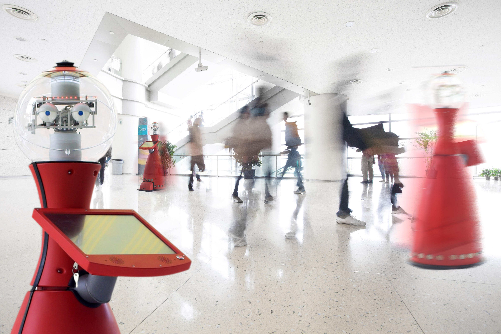
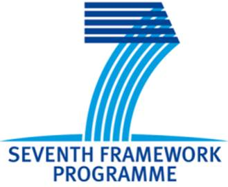
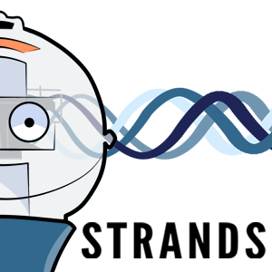

STRANDS Data Sets
=================

### Object Recognition Data Sets:

**STRANDS** data sets are provided for testing and benchmarking robotics and computer visions algorithms.

### Object Recognition RGB-D Data Sets:

[TUW data sets](https://repo.acin.tuwien.ac.at/tmp/permanent/dataset_index.php): Several Ground truth and annotated data sets from TUW. This data is targeted towards object instance recognition.

[3DNet Dataset](https://repo.acin.tuwien.ac.at/tmp/permanent/3d-net.org): The 3DNet dataset is a free resource for object class recognition and 6DOF pose estimation from point cloud data. Alternative link: [3DNet Dataset](https://strands.pdc.kth.se/public/3DNet_Dataset/)

### Long Term Mapping Data Sets:

[MHT RGB-D](https://lcas.lincoln.ac.uk/owncloud/shared/datasets/mht_rgbd.html): RGB-D image data of three locations in a MHT lab collect by a robot every 5 min over 16 days by the University of Lincoln. This data is described in Krajnik et al., Spectral analysis for long-term robotic mapping, ICRA 2014. (tkrajnik@lincoln.ac.uk)

[Witham Wharf](https://lcas.lincoln.ac.uk/owncloud/shared/datasets/wharf_rgbd.html): RGB-D snapshots of eight locations collected by a mobile robot over the period of one year by the University of Lincoln. Data is described in: Krajnik et al., Long-Term Topological Localization for Service Robots in in Dynamic Environments using spectral maps, IROS 2014. (tkrajnik@lincoln.ac.uk) Alternative link: [Witham Wharf Dataset](https://strands.pdc.kth.se/public/Witham_Wharf_RGB-D_dataset/)

[Small office data sets](https://lcas.lincoln.ac.uk/owncloud/shared/datasets/greg-office.html): Kinect depth images every 5 seconds between April 2014 and May 2016. Data is provided by the University of Lincoln. This data is described in Krajnik et al., FROctomap: an efficient spatio-temporal environment representation, Advances in Autonomous Robotics Systems, 2014. (tkrajnik@lincoln.ac.uk)

[Meta rooms](https://strands.pdc.kth.se/public/metric_sweeps_201312/readme.html): RGB-D data with registration over several days and places. (raambrus@kth.se)

[G4S meta rooms](https://lcas.lincoln.ac.uk/owncloud/public.php?service=files&t=cee1ceb7fb49ad373288f1249b7ff48b&dir=%2FG4S_2014): RGB-D data 150 sweeps with 18 images per sweep. This data is not public. (c.j.c.burbridge@cs.bham.ac.uk)

[LAD](https://dartportal.leeds.ac.uk/dataset/lad): The Leeds Activity Dataset--Breakfast (LAD--Breakfast) is currently composed of 15 annotated videos, representing five different people having breakfast or other simple meal; it is recorded within a lab setting, but is as realistic as possible (real food, eating and drinking). The videos were recorded using an ASUS Xtion PRO LIVE - RGB and Depth Sensor. The objects in the video were tracked using an OpenNI based tool created by our RACE project partner, the University of Aveiro (this data set has be co-created by RACE and STRANDS) and the ground truth provided makes reference to the objects tracked. The videos have been annotated with activities at various levels of complexity and abstraction to be selected, in order to build a hierarchy of activities. The videos were not scripted in detail: each person could choose what to eat or drink and when, and the objects he needed were on the table. The videos are quite varied in terms of duration, type and sequence of activities, number and type of visible objects. High level activities such as "preparing coffee" or "consuming meal" are composed of low level ones (e.g. "pickup kettle", "pour kettle", "putdown kettle"). (e.chinellato@leeds.ac.uk) Alternative link: [LAD Dataset](https://strands.pdc.kth.se/public/LAD/)

[People tracks](https://strands.pdc.kth.se/public/TrackData/readme.html): The data was collected at the end of 2014 in University of Birmingham library. It is composed of 6251 human tracks which can be used for human motion analysis. Contact: ferdian.jovan@gmail.com

[Long-term object people presence data set](https://lcas.lincoln.ac.uk/owncloud/shared/datasets/presence.html): Several weeks of person/object presence in three different environments. Used for robot search in Krajnik et al.: Where's waldo at time t ? using spatio-temporal models for mobile robot search. In ICRA 2014. Used for life-long exploration in Santos et al.: Spatio-temporal exploration strategies for long-term autonomy of mobile robots. Robotics and Autonomous Systems, 2016.(tkrajnik@lincoln.ac.uk)

[Long-term people activity data set](https://lcas.lincoln.ac.uk/owncloud/shared/datasets/activity.html): Several weeks of person activity in two different environments. Described in Coppola et al.: Learning temporal context for activity recognition, In ECAI, 2015.(tkrajnik@lincoln.ac.uk)

### Autonomous Long-term Learning Data Sets:

[Longterm](https://strands.pdc.kth.se/public/KTH_longterm_dataset_registered/readme.html): 8 locations over more than one month; contains 51 stiched point clouds, with camera poses and camera parameters as well as registered and corrected poses and parameters. (raambrus@kth.se)

[Longterm Labeled](https://strands.pdc.kth.se/public/KTH_longterm_dataset_labels/readme.html): This dataset contains a subset of the observations from the longterm dataset (longterm dataset above). In addition to the raw data, this dataset also stores for each observation object annotations (masks and labels). (raambrus@kth.se)

[Moving Labeled](https://strands.pdc.kth.se/public/KTH_labelled_moving_objects/readme.html): This dataset extends the longterm datatset with more locations within the same office environment at KTH. The dataset contains a subset of the labels and these objects are consistently located in different positions in multiple rooms. (nbore@kth.se)

[KTH-3D-TOTAL](https://strands.pdc.kth.se/public/kth-3d-total/readme.html): RGB-D Data with objects on desktops annotated. 20 Desks, 3 times per day, over 19 days. Data provided by KTH and described in, Thippur et al., "KTH-3D-TOTAL: A 3D Dataset for Discovering Spatial Structures for Long-Term Autonomous Learning", International Conference on Control, Automation, Robotics and Vision, ICARCV 2014. (akshaya@kth.se)

[Marathon](https://strands.pdc.kth.se/public/Marathon_2014/readme.html): Strands Marathon 2014 data, from all universities; contains metric sweeps and mongodb databases with other system logs: (raambrus@kth.se)

### People Data Sets:

[Long-term robot navigation data set](https://lcas.lincoln.ac.uk/owncloud/shared/datasets/aaf.html): Data from a mobile robot that served as an info-terminal, assistant-therapist and bellboy in a care home in Vienna for more than 120 days, covering over 100km. (tkrajnik@lincoln.ac.uk)

[Automated benchmarking data sets](https://lcas.lincoln.ac.uk/owncloud/shared/datasets/automated.html): Under Construction (tkrajnik@lincoln.ac.uk)

\

**Contact** \
 John Folksson\
 School of Computer Science and Cmmunications\
 KTH Royal Institute of Technolgy\
 SE-10044 Stockholm \
 Sweden\
 [johnf@kth.se](mailto:johnf@kth.se)\
 [http://www.csc.kth.se/\~johnf/](http://www.csc.kth.se/~johnf/)

* * * * *

 

This project is funded by the European Community's Seventh Framework Programme, Cognitive Systems and Robotics, project reference 600623.

This Website is maintained by the [Automation and Control Institute (ACIN)](http://www.acin.tuwien.ac.at/index.php?id=1&L=1), [TU Vienna](http://www.tuwien.ac.at/tuwien_home/EN/)

[Impressum](http://strands.acin.tuwien.ac.at/impressum.html)
