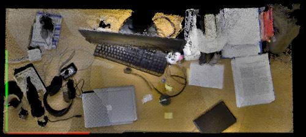

KTH-3D-TOTAL
------------

+------------+------------+------------+
| |image3|   | |image4|   | |image5|   |
+------------+------------+------------+

Sample table tops recorded in the dataset

This dataset constains RGB-D data with annotated objects on desktops. In total 20 desks have been recorded, 3 times per day over 19 days.

Download
~~~~~~~~

This dataset is available for download in a single archive `file <https://strands.pdc.kth.se/public/kth-3d-total.tar.gz>`__ (~ 177 GB). As an alternative, the individual folders and files can be obtained from `here <https://strands.pdc.kth.se/public/kth-3d-total>`__, and would have to be downloaded manually.

--------------

Condition of use
~~~~~~~~~~~~~~~~

If you use the dataset for your research, please cite our `paper <https://strands.pdc.kth.se/public/kth-3d-total/thippur2014.pdf>`__ that describes it:

::

        
        KTH-3D-TOTAL: A 3D dataset for discovering spatial structures for long-term autonomous learning
        Thippur, Akshaya and Ambrus, Rares and Agrawal, Gaurav and Del Burgo, Adria Gallart and Ramesh, 
        Janardhan Haryadi and Jha, Mayank Kumar and Akhil, Malepati Bala Siva Sai and Shetty, 
        Nishan Bhavanishankar and Folkesson, John and Jensfelt, Patric
        Control Automation Robotics & Vision (ICARCV), 2014 13th International Conference on
        
        

We attached a `bibtex <https://strands.pdc.kth.se/public/kth-3d-total/thippur2014.bib>`__ record for your convenience.

.. |image0| image:: images/kth_3d/t1.jpg
.. |image1| image:: images/kth_3d/t2.jpg

.. |image3| image:: images/kth_3d/t1.jpg
.. |image4| image:: images/kth_3d/t2.jpg

Original page: https://strands.pdc.kth.se/public/kth-3d-total/readme.html