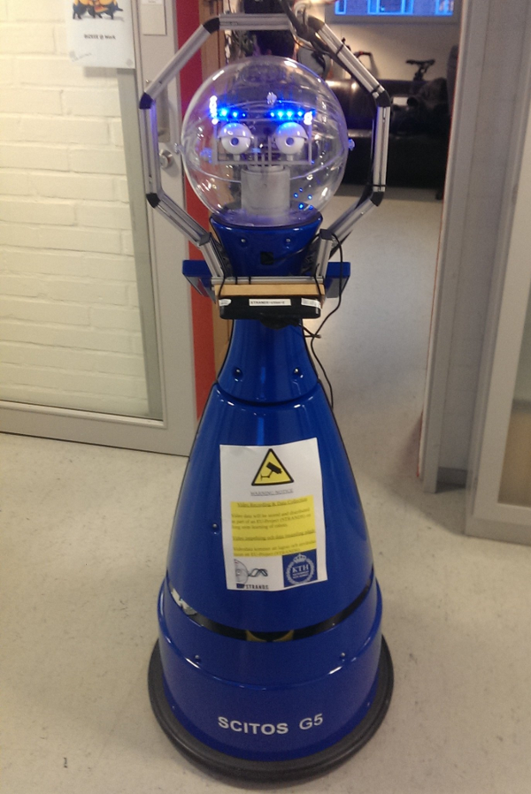
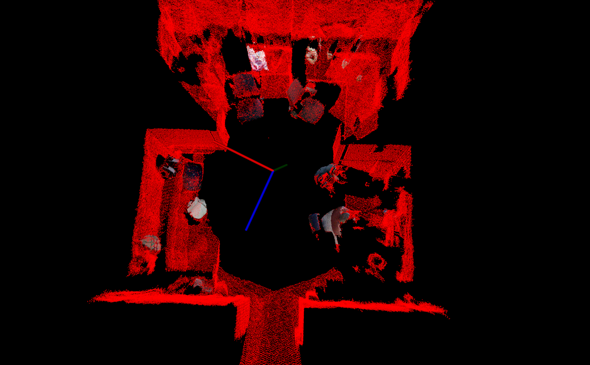

KTH Moving Objects Dataset
--------------------------

|image0|

KTH Scitos G5 robot - Rosie

This dataset extends `KTH Longterm Dataset Labels <kth_lt_labels.html>`__ with more locations within the same office environment at KTH. The dataset contains a subset of the labels and these objects are consistently located in different positions in multiple rooms. The label subset annotated in this dataset is {*chair6*, *chair1*, *water\_boiler*, *backpack1*, *pillow*, *trash\_bin*, *backpack3*, *chair2*, *hanger\_jacket*, *backpack2*}. Each observation consists of a set of 17 RGB-D images obtained by moving the pan-tilt in a horizontal pattern, in increments of 20 degrees. In addition to the raw sensor data, each observation contains object annotations (masks and labels). The data is a part of the `Strands <http://strands.acin.tuwien.ac.at/index.html>`__ EU FP7 project.

Dataset structure
~~~~~~~~~~~~~~~~~

The `data <https://strands.pdc.kth.se/public/KTH_longterm_dataset_labels>`__ is structured in folders as follows: *YYYYMMDD/patrol\_run\_YYY/room\_ZZZ*, where:

-  **YYYYMMDD** represents the year, month & day when those particular observations were acquired. Each such folder contains the patrol runs the robot collected on that specific date.
-  **patrol\_run\_YYY** represents one of the patrol runs collected by the robot.
-  **room\_ZZZ** represents a particular observation collected during a patrol run.

Each folder of the type *YYYMMDD/patrol\_run\_YYY/room\_ZZZ* contains the following files:

-  **room.xml** - contains information relevant for the observation (described in the next section)
-  **surfel\_map.pcd** - the surfel map constructed by using the data fusion component of `Elastic Fusion <https://github.com/mp3guy/ElasticFusion>`__
-  **complete\_cloud.pcd** - the point cloud of the observation (obtained by thresholding the confidence of surfel\_map.pcd at 0.3)
-  **intermediate\_cloudXXXX.pcd** - ordered point clouds, each corresponding to an RGB and depth image acquired by the camera while conducting the sweep (17 such point clouds for each observation, with **XXXX** going from 0000 to 0016)
-  **rgb\_XXXX.jpg** - RGB image generated from the corresponding **intermediate\_cloudXXXX.pcd**
-  **depth\_XXXX.png** - depth image generated from the corresponding **intermediate\_cloudXXXX.pcd**
-  **rgb\_XXXX\_label\_#.jpg** - binary mask corresponding to one of the objects annotated in the image **rgb\_XXXX.jpg**
-  **rgb\_XXXX\_label\_#.pcd** - point cloud generated from object mask **rgb\_XXXX\_label\_#.jpg**
-  **rgb\_XXXX\_label\_#.txt** - object label corresponding to annotation **rgb\_XXXX\_label\_#.jpg**
-  **rgb\_XXXX\_label\_#.xml** - xml file storing the labelled object data (created with data from **rgb\_XXXX\_label\_#.pcd**, **rgb\_XXXX\_label\_#.txt**)
-  **rgb\_XXXX\_object\_#.jpg** - rgb mask corresponding to one of the objects annotated in the image **rgb\_XXXX.jpg**

| The description of the *room.xml* file accompanying an observation can be found `here <kth_lt.html>`__.
|  Each object xml file (**rgb\_XXXX\_label\_#.xml**) contains the following data:

-  **label** - object label
-  **filename** - object pcd file
-  **Centroid** - object centroid, in the map frame
-  **LogTime** - time when the object was observed

Parsing
~~~~~~~

| A parser is provided `here <https://github.com/strands-project/strands_3d_mapping/tree/hydro-devel/metaroom_xml_parser>`__ (can be installed with `` sudo apt-get install ros-indigo-metaroom-xml-parser``) which reads in the data and returns C++ data structures encapsulating the low-level data from the disk. Form more information please refer to `the parser README <https://github.com/strands-project/strands_3d_mapping/tree/hydro-devel/metaroom_xml_parser>`__ ( or `here <https://github.com/strands-project/strands_3d_mapping/blob/hydro-devel/metaroom_xml_parser/include/metaroom_xml_parser/load_utilities.h>`__ for a list of supported methods). Information about how to use the Strands package repository can be found `here <https://github.com/strands-project-releases/strands-releases/wiki>`__.
|  Assuming `the parser <https://github.com/strands-project/strands_3d_mapping/tree/hydro-devel/metaroom_xml_parser>`__ has been installed, the labelled data can be visualized with the following sample application:
|  `` rosrun metaroom_xml_parser load_labelled_data /path/to/data WayPoint10 ``
|  This loads all the observations along with the labelled data from the path specified and displays each observation along with the corresponding labelled objects in a visualizer window.

+------------+------------+------------+
| |image4|   | |image5|   | |image6|   |
+------------+------------+------------+

Observation (red) with labelled objects (RGB)

Labelling
~~~~~~~~~

For more information on the labelling tool used, please refer to `this page <https://github.com/RaresAmbrus/strands_3d_mapping/tree/metric_map_labelling/labelling>`__.

Download
~~~~~~~~

This dataset is available for download in a single archive `file <https://strands.pdc.kth.se/public/KTH_labelled_moving_objects.tar.gz>`__ (~ 6 GB). As an alternative, the individual folders and files can be obtained from `here <https://strands.pdc.kth.se/public/KTH_labelled_moving_objects>`__, and would have to be downloaded manually.

--------------

Contact
~~~~~~~

| `Nils Bore <mailto:nbore@kth.se>`__
|  `http://www.csc.kth.se/~nbore/ <http://www.csc.kth.se/~nbore/>`__
|  CSC/CVAP
|  KTH
|  SE-100 44 Stockholm
|  Sweden

.. |image1| image:: images/kth_lt_moving/labelled1.png
.. |image2| image:: images/kth_lt_moving/labelled2.png

.. |image4| image:: images/kth_lt_moving/labelled1.png
.. |image5| image:: images/kth_lt_moving/labelled2.png

Original page: https://strands.pdc.kth.se/public/KTH_labelled_moving_objects/readme.html