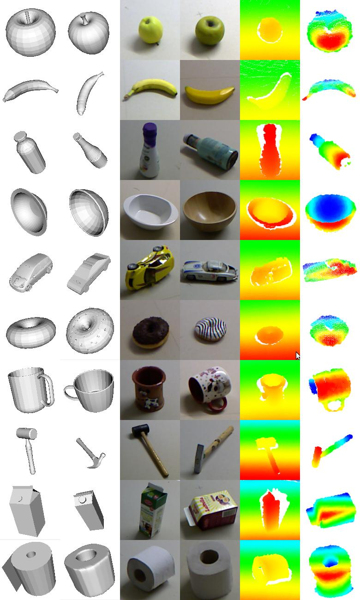
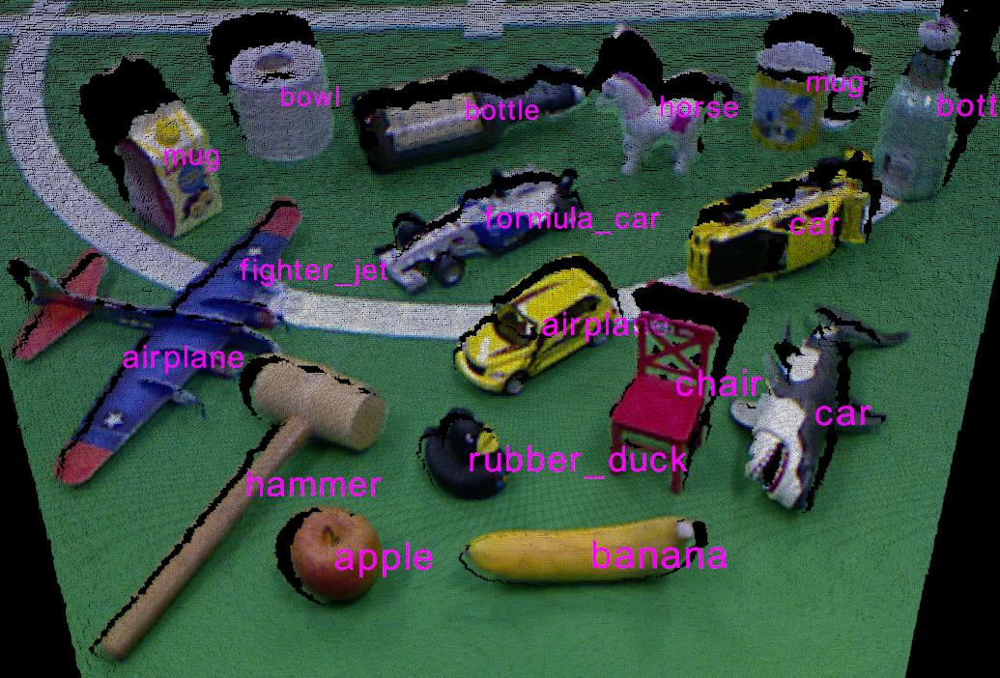

3DNet Dataset
=============

The 3DNet dataset is a free resource for object class recognition and 6DOF pose estimation from point cloud data. 3DNet provides a large-scale hierarchical CAD-model databases with increasing numbers of classes and difficulty with 10, 60 and 200 object classes together with evaluation datasets that contain thousands of scenes captured with an RGB-D sensor.

| When using this database, please cite:
|  Walter Wohlkinger, Aitor Aldoma Buchaca, Radu Rusu, Markus Vincze. *"3DNet: Large-Scale Object Class Recognition from CAD Models"*. In IEEE International Conference on Robotics and Automation (ICRA), 2012. (`PDF <https://repo.acin.tuwien.ac.at/tmp/permanent/3d-net.org/wohlkinger20123dnet.pdf>`__) (`bibtex <https://repo.acin.tuwien.ac.at/tmp/permanent/3d-net.org/wohlkinger20123dnet.bib>`__)

|image0|

|image1|

-  Cat10: Basic object classes
   ~~~~~~~~~~~~~~~~~~~~~~~~~~~

   The basic dataset consists of common, simple, geometrically distinguishable but partially similar objects.

   `Cat10\_ModelDatabase.zip (42 MB) <https://repo.acin.tuwien.ac.at/tmp/permanent/3d-net.org/Cat10_ModelDatabase.zip>`__

   `Cat10\_TestDatabase.zip (3.6 GB) <https://repo.acin.tuwien.ac.at/tmp/permanent/3d-net.org/Cat10_TestDatabase.zip>`__

-  Cat60: Subclasses
   ~~~~~~~~~~~~~~~~~

   The Cat50 model database consists of the Cat10 database with 50 additional classes. The classes in this database are still distinguishable by shape only, but also include subcategories (chair, office-chair, armchair and car, convertible, pickup, formula-car).

   `Cat60\_ModelDatabase.zip (222 MB) <https://repo.acin.tuwien.ac.at/tmp/permanent/3d-net.org/Cat60_ModelDatabase.zip>`__

   `Cat60\_TestDatabase.zip (3.7 GB) <https://repo.acin.tuwien.ac.at/tmp/permanent/3d-net.org/Cat60_TestDatabase.zip>`__

-  Cat200: Color and size
   ~~~~~~~~~~~~~~~~~~~~~~

   This database adds objects which are similar in shape but can be uniquely distinguished when using color as an additional cue. One more important aspect of objects and object classes was not used and not needed in the previous category databases: size. To successfully distinguish among our 200 categories database, the real world size of the objects becomes important.

   `Cat200\_ModelDatabase.zip (569 MB) <https://repo.acin.tuwien.ac.at/tmp/permanent/3d-net.org/Cat200_ModelDatabase.zip>`__

Original page: https://repo.acin.tuwien.ac.at/tmp/permanent/3d-net.org/